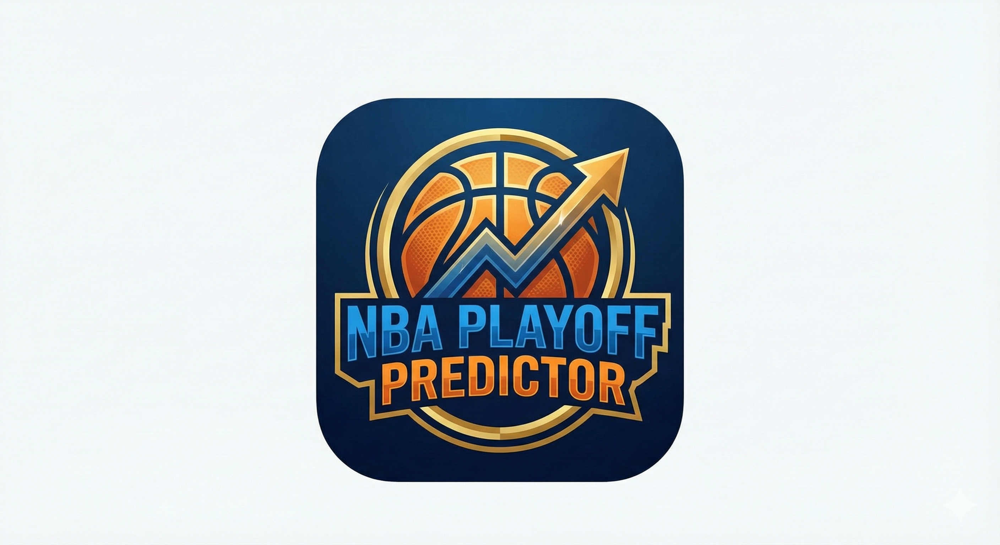

<div align="center">

  

# 🏀 NBA Playoff Predictor

**Compete with friends, predict the bracket, and track live scores.**

A full-stack cross-platform application (Web & Android) built for NBA fans.

[Live Demo](https://nba-app-five.vercel.app)

  <br />


</div>

<br />

## 📋 About The Project

**NBA Playoff Predictor** is a powerful application that allows users to create private leagues, predict the NBA regular season standings, and fill out the full playoff bracket.

Originally a web app, it has been evolved into a **Native Android Application** using **Capacitor**, offering a seamless mobile experience with native status bars, splash screens, and smooth performance. The app uses a unique "Golf Scoring" system (lower is better) and updates scores in real-time based on actual NBA results.

## ✨ Key Features

### 📱 Mobile Native Experience
- **Native Android App:** Fully functional `.apk` build running natively on Android devices.
- **Optimized UI:** Full-screen immersive mode with NBA-themed status bar (`#1D428A`).
- **Touch Controls:** Native-feel scrolling, disabled text selection, and removed tap highlights.
- **Custom Assets:** Adaptive launcher icons and splash screens generated via `capacitor-assets`.

### 🎮 User Experience
- **Interactive Bracket:** A visual, dynamic playoff bracket that handles dependencies.
- **Zoom & Pan Controls:** Built-in zoom functionality to view the massive bracket easily on small screens.
- **Mobile Action Bar:** A sticky bottom bar for easy access to "Save" and zoom controls on mobile devices.
- **Drag & Drop:** Easily rank teams for the East/West conference standings.
- **Smart Validation:** Automatically advances winners to the next round (Round 1 → Finals).

### 🏆 Competition & Scoring
- **League System:** Create private leagues or join existing ones via a unique code.
- **Leaderboard:** Real-time ranking with "Golf Rules" scoring.
- **Live Updates:** Scores update automatically as real NBA games conclude.

### 🛡️ Admin & Security
- **Super Admin Panel:** A secure dashboard to update official NBA results (Hidden via Env Vars).
- **Row Level Security (RLS):** Ensures users can only modify their own predictions.
- **Locking Mechanism:** Leagues can be locked to prevent changes after tip-off.

## 🛠️ Tech Stack

- **Frontend:** React (Vite), TypeScript
- **Mobile Runtime:** Capacitor (Android)
- **Styling:** Tailwind CSS (Dark Mode aesthetic)
- **State Management:** React Hooks
- **Backend / DB:** Supabase (PostgreSQL)
- **Authentication:** Supabase Auth
- **Tools:** Android Studio, Prettier, ESLint

## 📥 Download Android App

**An APK file is included in this repository!** 📱

You can download the `NBA-Predictor.apk` file directly from the files above and install it on your Android device to get the full native experience.

## 🚀 Getting Started

Follow these steps to run the project locally or build for Android.

### Prerequisites
- Node.js (v18+)
- Android Studio (for mobile builds)

### Installation

1.  **Clone the repo**
    ```sh
    git clone [https://github.com/harel3782/nba-app.git](https://github.com/harel3782/nba-app.git)
    cd nba-app
    ```

2.  **Install dependencies**
    ```sh
    npm install
    ```

3.  **Environment Variables**
    Create a `.env` file in the root directory. **Do not commit this file.**
    
    ```env
    VITE_SUPABASE_URL=your_supabase_url
    VITE_SUPABASE_ANON_KEY=your_supabase_anon_key
    
    # The email address that will have Super Admin access
    VITE_SUPER_ADMIN_EMAIL=your_admin_email@gmail.com
    ```

### 🖥️ Run on Web
```sh
npm run dev
```

### 🤖 Build for Android
To generate the APK for mobile devices:

1.  **Build the web assets:**
    ```sh
    npm run build
    ```

2.  **Sync with Capacitor:**
    ```sh
    npx cap sync
    ```

3.  **Open in Android Studio:**
    ```sh
    npx cap open android
    ```
    *From here, connect your device and click "Run" (▶️) or Build > Build APK.*

## 📐 Database Schema

The project uses a normalized PostgreSQL schema hosted on Supabase:

- `users`: Managed by Supabase Auth.
- `leagues`: Stores league settings & lock status.
- `predictions`: Stores regular season ranking predictions.
- `tournament_predictions`: Stores bracket picks (Play-in to Finals).
- `official_standings` & `official_playoff_results`: The "Truth" tables updated by Admin.
- `leaderboard`: Materialized view for high-performance ranking.

## 👤 Author

**Harel Mashiah**

- Project Link: [https://github.com/harel3782/nba-app](https://github.com/harel3782/nba-app)
